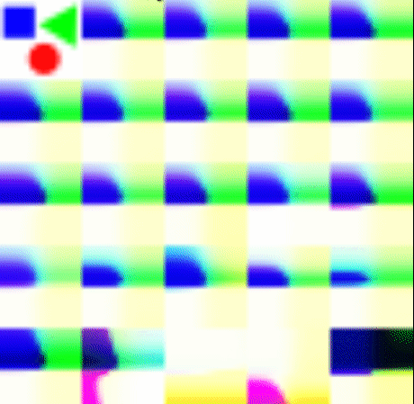
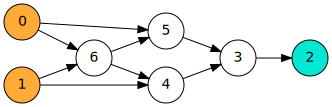
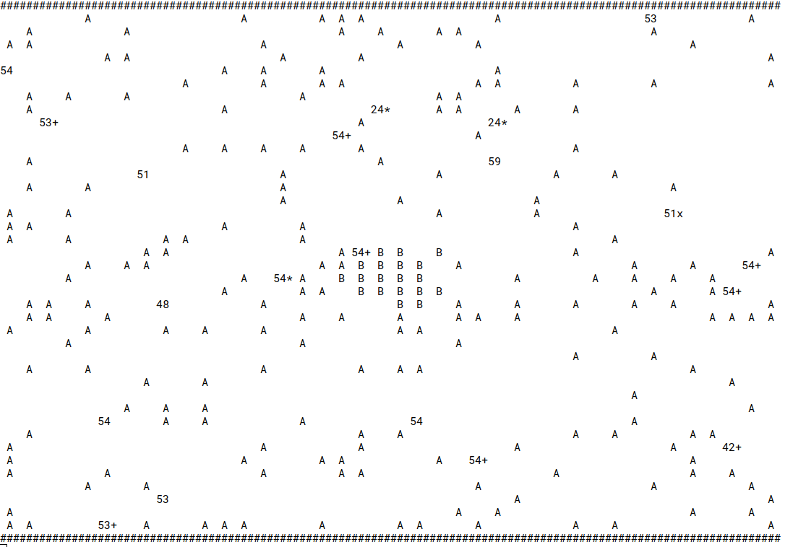

# Aiolia

Genetic algorithm for Graph Grammars

# Idea

DNA is a highly compressed representation of the living organism it represents. We use this idea to tackle different interesting optimization problems. Our approach is to define a [formal language](https://en.wikipedia.org/wiki/Formal_language) for [graph grammars](https://en.wikipedia.org/wiki/Graph_rewriting) (see [Grammar.scala](src/main/scala/grammar/Grammar.scala)) used as genotypes in a [genetic algorithm](https://en.wikipedia.org/wiki/Genetic_algorithm) (see [GeneticAlgorithm.scala](src/main/scala/geneticAlgorithm/GeneticAlgorithm.scala)).

# Image compression

A feed-forward [neural network](https://en.wikipedia.org/wiki/Artificial_neural_network) which maps from (X,Y) coordinates of an image to its color (R,G,B). The topology and weights of the neural network are generated from a grammar and optimized by the genetic algorithm to match the target image.

See [ImageCompression.scala](src/main/scala/app/ImageCompression.scala).

```
$ sbt run
# then choose aiolia.app.ImageCompression
```

Then look at `/tmp/population.png`.



The top left image is the target image.

Insight: The generated image gets into the direction of the target image but gets stuck at a certain point. This is probably because the weights of the neural network are also encoded in the grammar. They should be optimized using [backpropagation](https://en.wikipedia.org/wiki/Backpropagation) or [CMA-ES](https://en.wikipedia.org/wiki/CMA-ES) instead after generating the network.

# Circuit Design

Design a circuit of [NAND gates](https://en.wikipedia.org/wiki/NAND_logic) to represent a boolean function. The boolean function is described by a set of examples.

See [CircuitDesign.scala](src/main/scala/app/CircuitDesign.scala).

```
$ sbt run
# then choose aiolia.app.CircuitDesign
```

It generates a `dot` graph at `/tmp/currentgraph.dot`.
Convert it to svg using: `dot -Tsvg currentgraph.dot > currentgraph.svg`



Insight: The algorithm is able successfully synthesise a [minimal XOR from NAND gates](https://en.wikipedia.org/wiki/NAND_logic#XOR), but does not scale well to bigger problems. The search space seems too big.

# Artificial Life

On a 2D-Grid artificial creatures should compete for food to survive. Food is randomly placed on the grid over time. The creatures can walk across the grid and see what's around them. The consist of a [recurrent neural network](https://en.wikipedia.org/wiki/Recurrent_neural_network) which maps their `sight field` and `energy level` to actions like `move`, `replicate`, `fight`. At replication a mutation is applied to the grammar.

See [LivingZoo.scala](src/main/scala/app/zoo/LivingZoo.scala).

```
$ sbt run
# then choose aiolia.app.zoo.Zoo
```


